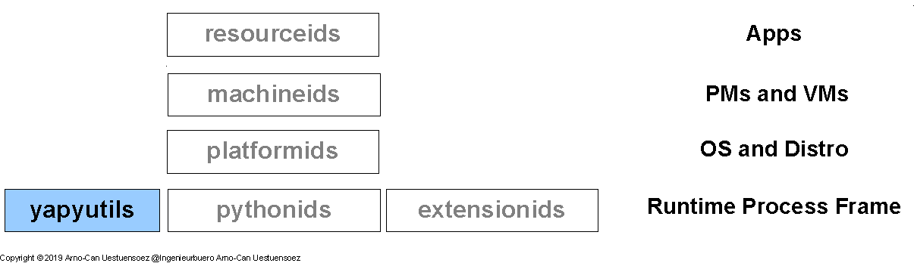

********
Abstract
********

Modern landscapes of information infrastructures are commonly designed 
and organized as stacks of runtime service environments.
The technical architecture of the service stacks consists of a wide range of
heterogenous landscapes of components frequently requiring adaptation and mediation.
When it comes to complex infrastructures services such as *XaaS*, this frequently requires complex
runtime features on the lower layers, which frequently are available on higher layers only.

The *yapyutils* provides advanced features commonly required for dynamic runtime setups 
of infrastructure services.
This includes for example the transparent and intermixed access to various modern configuration formats
such as *YAML*, *XML*, *JSON* including classic setups by *INI* and *properties* files.
The package also supports basic functions for flexible import of platform dependent modules by search and load.
The package supports therefore the required core features for operations by minimal external dependencies.

   
   Figure: Software Dependecy Layers |figuresystemabstractprint_zoom| :ref:`more... <REFERENCE_ARCHITECTURE>`

.. |figuresystemabstractprint_zoom| image:: _static/zoom.png
   :alt: zoom 
   :target: _static/systems-ids.png
   :width: 16

The *yapyutils* - *Yet Another Python Utils* - provides a collection of low-level modules supporting
for the abstraction of the evolving *Python* implementation interfaces.
These are allocated within the software stack at the bare-level of the *Python* framework
with support for all major implementations and variants - *CPython*, *IPython*, *IronPython*, *Jython*,
*PyPy*, and *Stackless*.  
See following section :ref:`Blueprint <REFERENCE_ARCHITECTURE>` for more details,
refer to  :ref:`Tested Platforms <TESTED_OS_PYTHON>` for the full list.

The package '*yapyutils*' is part of the set of packages of enumerations for efficient and fast operations of
code variants for software and infrastructure stacks. 
For other stack layers refer to [machineids]_, [platformids]_, [pythonids]_, [resourceids]_, and [extensionids]_.

Refer also to the virtual package [enumerateit]_ for the overall IT stack enumeration.
